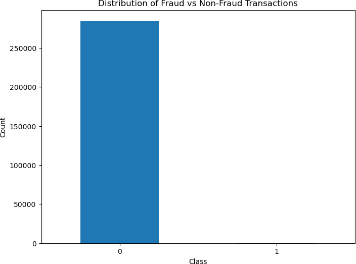
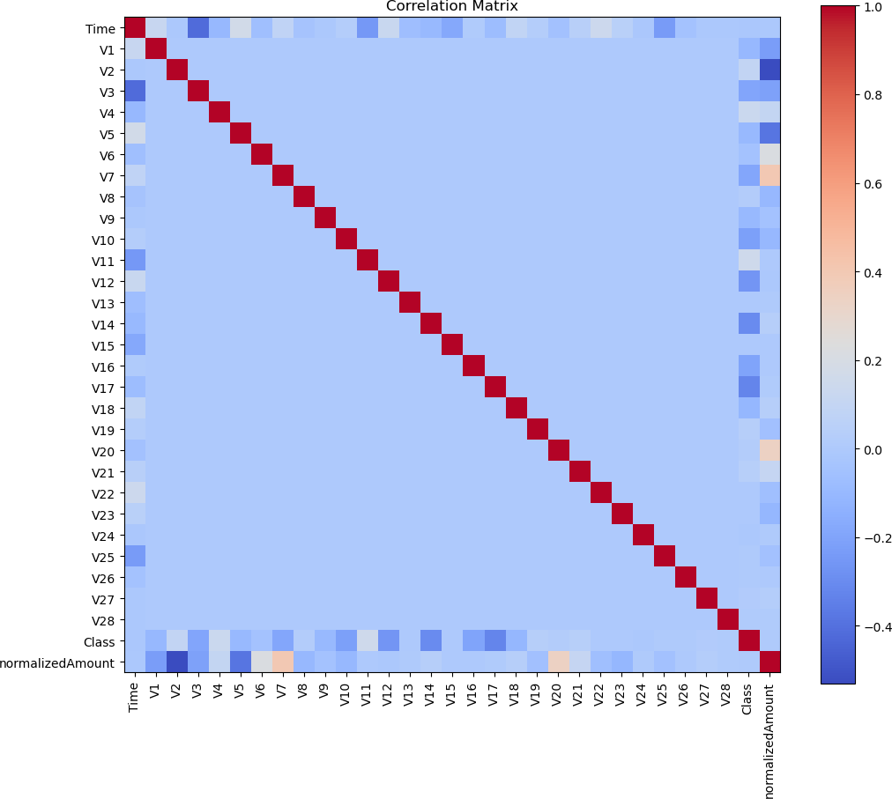
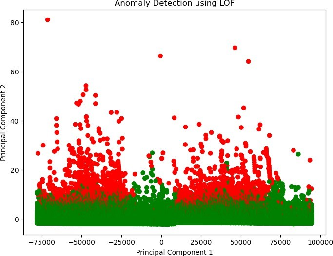
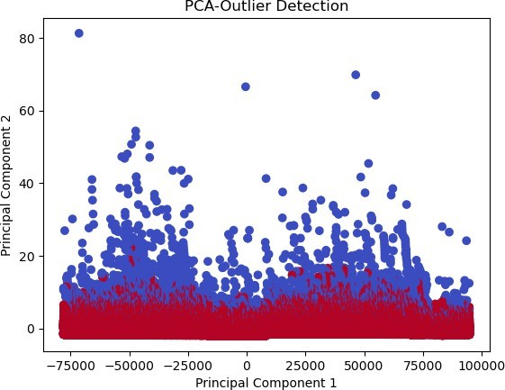
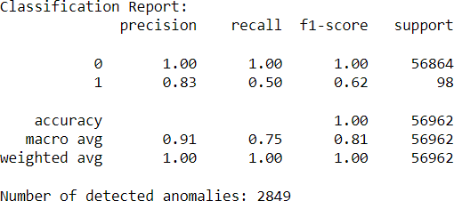

# Fraudulent Transaction Detection  

This project implements a Fraudulent Transaction Detection system using Data Analytics and Artificial Intelligence (AI) techniques. The system leverages data visualization, outlier detection, anomaly detection, and classification algorithms to identify and flag fraudulent transactions in a given dataset.  

## Table of Contents  
- [Overview](#overview)  
- [Features](#features)  
- [Technologies Used](#technologies-used)  
- [Project Structure](#project-structure)  
- [Setup Instructions](#setup-instructions)  
- [Usage](#usage)  
- [Results](#results)  
- [References](#references)  

## Overview  
Fraudulent transactions in industries like finance can lead to significant financial losses. This project provides a comprehensive framework to detect such transactions, combining Data Analytics and AI techniques, along with a user-friendly GUI for easy interaction.  

### Key Objectives:  
1. Analyze the characteristics of fraudulent and non-fraudulent transactions.  
2. Build models for detecting anomalies and classifying transactions.  
3. Provide visualizations and reports for better insights.  
4. Ensure the system is robust and scalable for real-world applications.  

## Features  
- **Data Analytics (DA):**  
  - Data visualization of fraud vs. non-fraud transactions.  
  - Correlation matrix analysis.  
  - Time-series and transaction amount analysis.  

- **Artificial Intelligence (AI):**  
  - Outlier detection using Isolation Forest.  
  - Dimensionality reduction via PCA.  
  - Classification using Logistic Regression, Naive Bayes, and Random Forest.  
  - Anomaly detection using Local Outlier Factor.  

- **Graphical User Interface (GUI):**  
  - Easy-to-use GUI built with Tkinter.  
  - Allows execution of DA and AI tasks with simple button clicks.  

## Technologies Used  
- **Programming Language:** Python  
- **Libraries:**  
  - Data Analysis: Pandas, NumPy  
  - Visualization: Matplotlib, Seaborn  
  - Machine Learning: Scikit-learn  
  - GUI Development: Tkinter  

## Project Structure  
```plaintext
FraudDetection/
├── README.md                 # Overview of the project
├── Block Diagram/            # System Representation
│   └── Block_Diagram.png     
├── requirements.txt          # Python dependencies
├── src/                      # Source code directory
│   ├── preprocess.py         # Data loading and preprocessing
│   ├── analytics.py          # Data analytics tasks
│   ├── ai_functions.py       # AI functionalities (outlier detection, PCA, classification, etc.)
│   ├── visualization.py      # Visualization utilities
│   └── gui.py                # Code for the Tkinter GUI
├── Outputs/                  # Outputs like plots, results, and reports
│   ├── Anomaly Detection Using LOF.jpg               
│   ├── Classification Report.png                
│   ├── Distribution of Transactions Over Time.png
│   ├── Mean Transaction Amount Calculation.png   
│   ├── Outlier Detection.png                
│   ├── PCA-Outlier Dectection.jpg
│   ├── Pie Chart.jpg                
│   ├── Random Forest Classification Report.png
│   └── Correlation_matrix.png       
└── tests/                    # Unit tests for the project
    └── test_ai_functions.py  # Tests for AI functionalities

```

## Dataset  
The dataset used for this project is the **Credit Card Fraud Detection Dataset** hosted on Kaggle. You can download it directly from the following link:  

[Credit Card Fraud Detection Dataset on Kaggle](https://www.kaggle.com/datasets/mlg-ulb/creditcardfraud)  

## Setup Instructions  
1. Clone the repository:  
   ```bash
   git clone https://github.com/anna123venkat/FraudTransactionDetection.git
   cd FraudDetection
   ```  
2. Install the required dependencies:  
   ```bash
   pip install -r requirements.txt
   ```  
3. Run the application:  
   ```bash
   python src/gui.py
   ```  

## Usage  
- Use the GUI to execute Data Analytics and AI functionalities.  
- View the generated plots and results in the `outputs/` directory.  
- Evaluate performance metrics like accuracy, precision, and recall through the logs and console output.  

## Results  

### Distribution of Fraud vs. Non-Fraud Transactions  


### Correlation Matrix Analysis


### Outlier Detection and Anomaly Visualization 


### Outlier Detection 


### Classification Reports and Accuracy Metrics
  

## References  
1. [Tkinter Documentation](https://docs.python.org/3/library/tkinter.html)  
2. [Pandas Documentation](https://pandas.pydata.org/docs/)  
3. [Scikit-learn Documentation](https://scikit-learn.org/stable/documentation.html)  
4. [Credit Card Fraud Detection Dataset on Kaggle](https://www.kaggle.com/datasets/mlg-ulb/creditcardfraud)  

---

**Contributors:**  
- **[Hariharanvignesh K](https://github.com/vignesh5743)** 
- **[Prasanna Venkatesh S](https://github.com/anna123venkat)**
- Sakthi Jeganathan R  
